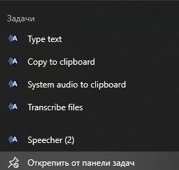

# Speecher

Консольное приложение для голосового ввода текста в Windows. Нажимаете горячую клавишу, говорите, нажимаете ещё раз — распознанный текст печатается в активное окно, будто вы набрали его с клавиатуры.

Распознавание работает локально, без облачных сервисов, на модели [Whisper](https://github.com/openai/whisper) (`ggml-large-v3-turbo`) через [Whisper.net](https://github.com/sandrohanea/whisper.net). Поддерживаются русский и английский языки, язык определяется автоматически.

## Возможности

- Запуск и остановка записи одной горячей клавишей (по умолчанию `Ctrl+Alt+Space`).
- Ввод текста в любое приложение через эмуляцию клавиатуры (Unicode, раскладка не важна).
- Автоматическое определение языка: русский или английский.
- Ускорение на GPU NVIDIA (CUDA 12), если нет подходящей видеокарты — работа на CPU.
- Голосовые команды: новая строка, табуляция, отмена последнего ввода.
- Два режима вывода: печать в активное окно или копирование фразы в буфер обмена. Оба доступны из jumplist на панели задач.
- Распознавание системного звука: отдельный режим из jumplist записывает не микрофон, а то, что играет на устройстве вывода по умолчанию (видео, игра, звонок).
- Расшифровка готовых аудиофайлов: отдельный режим из jumplist, принимает путь к файлу или папке.
- Отсечение слишком коротких записей и тишины.
- История распознанных фраз в `history.jsonl`.
- Портативность: все файлы хранятся рядом с exe, в системе ничего не устанавливается.

## Требования

- Windows 10 или 11, x64.
- Микрофон.
- Около 2 ГБ свободного места под модель; для CUDA — ещё примерно 1 ГБ под библиотеки.
- Для ускорения на GPU — видеокарта NVIDIA с установленным драйвером. CUDA Toolkit ставить не нужно.
- Для сборки — [Git](https://git-scm.com/download/win) и [.NET 9 SDK](https://dotnet.microsoft.com/download/dotnet/9.0) (x64).
- Интернет при первом запуске: для скачивания модели и библиотек CUDA.

## Установка

1. Установите [Git](https://git-scm.com/download/win) и [.NET 9 SDK](https://dotnet.microsoft.com/download/dotnet/9.0). Проверьте, что SDK установлен:

   ```powershell
   dotnet --list-sdks
   ```

   В списке должна быть версия `9.0.x`.

2. Если есть видеокарта NVIDIA, установите или обновите драйвер с [сайта NVIDIA](https://www.nvidia.com/drivers). Для CUDA 12 нужен драйвер версии 528 или новее. Без видеокарты NVIDIA этот шаг пропустите: приложение будет работать на CPU, но медленнее.

3. Клонируйте репозиторий и перейдите в его папку:

   ```powershell
   git clone https://github.com/Dalidovich/Speecher.git
   cd Speecher
   ```

4. Соберите приложение:

   ```powershell
   dotnet publish src/Speecher -c Release -o publish
   ```

   Зависимости NuGet скачаются автоматически. В папке `publish` появятся `Speecher.exe` и папка `runtimes` с нативными библиотеками Whisper. Это self-contained сборка: .NET для её запуска не нужен, и папку `publish` можно скопировать на другой компьютер. Держите `runtimes` рядом с exe.

5. Запустите приложение:

   ```powershell
   .\publish\Speecher.exe
   ```

   Первый запуск займёт время: скачивается модель (около 1,6 ГБ) и, при наличии NVIDIA, библиотеки CUDA. Когда в консоли появится `Ready`, можно диктовать.

6. Проверьте строку `Backend:` в консоли. `CUDA` — распознавание идёт на видеокарте, `CPU` — на процессоре. Если видеокарта NVIDIA есть, а написано `CPU`, обновите драйвер и удалите папку `publish/runtime`, чтобы библиотеки CUDA скачались заново.

## Первый запуск

При первом запуске приложение:

1. Создаёт `settings.json` с настройками по умолчанию.
2. Скачивает модель `ggml-large-v3-turbo.bin` (около 1,6 ГБ) с Hugging Face в папку `models`.
3. Если найден драйвер NVIDIA — скачивает библиотеки CUDA runtime (`cudart`, `cublas`) с сервера NVIDIA в папку `runtime/cuda` и сверяет их контрольные суммы. Если скачать не удалось, приложение продолжает работу на CPU.

Последующие запуски работают без интернета.

## Режимы

У приложения четыре режима. Каждый запускается своим пунктом jumplist на панели задач или аргументами командной строки.



Чтобы открыть jumplist, закрепите `Speecher.exe` на панели задач (или запустите его хотя бы раз) и щёлкните по значку правой кнопкой.

| Режим | Пункт jumplist | Командная строка | Источник звука | Куда попадает текст |
|---|---|---|---|---|
| [Печать текста](#печать-текста) | «Type text» | `Speecher.exe --output Type` | Микрофон | Активное окно |
| [Копирование в буфер](#копирование-в-буфер) | «Copy to clipboard» | `Speecher.exe --output Clipboard` | Микрофон | Буфер обмена |
| [Системный звук](#системный-звук) | «System audio to clipboard» | `Speecher.exe --source System --output Clipboard` | Устройство вывода | Буфер обмена |
| [Расшифровка файлов](#расшифровка-файлов) | «Transcribe files» | `Speecher.exe --files` | Аудиофайлы | Консоль и буфер обмена |

Запуск без аргументов (двойной щелчок по exe) записывает микрофон, а режим вывода берёт из `DefaultOutputMode` в `settings.json`, по умолчанию это копирование в буфер. Источник и вывод задаются независимо: `--source Microphone` или `System`, `--output Type` или `Clipboard`. Выбранные значения выводятся в консоль при запуске строками `Output mode:` и `Audio source:`.

Первые три режима управляются горячей клавишей одинаково:

1. Дождитесь сообщения `Ready` в консоли.
2. Нажмите горячую клавишу — начнётся запись.
3. Нажмите её ещё раз — запись остановится, и текст распознается.

Повторное нажатие во время распознавания или печати отменяет операцию. Запись автоматически останавливается по достижении `MaxRecordingSeconds`. Выход — `Ctrl+C` или закрытие окна консоли. Горячая клавиша регистрируется глобально, поэтому эти три режима не запускаются одновременно: перед сменой режима закройте работающий экземпляр.

### Печать текста

- **Запуск:** пункт «Type text» или `Speecher.exe --output Type`.
- **Источник звука:** микрофон из `MicrophoneName`, при пустом значении — системный микрофон по умолчанию.
- **Управление:** горячая клавиша. Перед записью поставьте курсор в поле ввода нужного приложения.
- **Результат:** фраза печатается в активное окно эмуляцией клавиатуры, после неё нажимается `Enter`. Перед печатью приложение ждёт, пока вы отпустите `Ctrl`, `Alt`, `Shift` и `Win`, чтобы зажатые модификаторы не превратили текст в сочетания клавиш.
- **Голосовые команды:** работают.
- **История:** фразы пишутся в `history.jsonl`.

### Копирование в буфер

- **Запуск:** пункт «Copy to clipboard» или `Speecher.exe --output Clipboard`.
- **Источник звука:** микрофон из `MicrophoneName`, при пустом значении — системный микрофон по умолчанию.
- **Управление:** горячая клавиша.
- **Результат:** фраза целиком помещается в буфер обмена, в окно ничего не печатается.
- **Голосовые команды:** работают, нажатия клавиш уходят в активное окно.
- **История:** фразы пишутся в `history.jsonl`.

### Системный звук

- **Запуск:** пункт «System audio to clipboard» или `Speecher.exe --source System`.
- **Источник звука:** то, что вы слышите: устройство вывода Windows по умолчанию, весь звук от всех приложений сразу (видео, игра, звонок). Устройство определяется заново в начале каждой записи, поэтому переключение с колонок на наушники подхватывается без перезапуска. Микрофон не нужен, `MicrophoneName` не используется.
- **Управление:** горячая клавиша. Если за время записи ничего не играло, запись пропускается.
- **Результат:** пункт jumplist копирует фразу в буфер обмена. Из командной строки вывод можно сменить: `Speecher.exe --source System --output Type`; без `--output` действует `DefaultOutputMode`.
- **Голосовые команды:** отключены, чтобы фраза «отмена» из видео не стёрла ваш текст.
- **История:** фразы пишутся в `history.jsonl`.

### Расшифровка файлов

- **Запуск:** пункт «Transcribe files» или `Speecher.exe --files`. С `--output` и `--source` не сочетается.
- **Источник звука:** аудиофайлы. Ogg Opus (голосовые сообщения Telegram) декодируется встроенным декодером, остальные форматы — средствами Windows Media Foundation: `wav`, `mp3`, `m4a`, `aac`, `wma`, `flac`, а также звуковые дорожки видео, например `mp4`.
- **Управление:** без горячей клавиши. После загрузки модели консоль запрашивает путь к файлу или папке и повторяет запрос после каждой обработки. Путь можно вводить в кавычках, например перетащив файл в окно консоли. Для папки приложение показывает число найденных файлов и просит подтверждение: `Enter` — продолжить, любой другой ввод — отмена.
- **Результат:** для файла текст выводится в консоль и копируется в буфер обмена. Для папки расшифровываются все файлы, включая вложенные: в консоль выводятся путь к файлу и его текст, записи отделены разделителем, буфер обмена не используется. Для файлов, которые не являются аудио, выводится ошибка, и обработка продолжается.
- **Голосовые команды:** не применяются.
- **История:** в `history.jsonl` не пишется.

Горячая клавиша в этом режиме не регистрируется, поэтому его можно держать открытым одновременно с любым другим.

## Голосовые команды

Если фраза целиком совпадает с командой (без учёта регистра и знаков препинания), вместо текста выполняется действие:

| Действие | Фразы по умолчанию | Что делает |
|---|---|---|
| `Enter` | «новая строка», «new line» | Нажимает `Enter` |
| `Tab` | «таб», «tab» | Нажимает `Tab` |
| `Undo` | «отмена», «undo» | Стирает `Backspace`-ом последний напечатанный фрагмент |

Список фраз можно изменить в `settings.json`.

## Настройки

Файл `settings.json` лежит рядом с exe и создаётся автоматически:

```json
{
  "Hotkey": "Ctrl+Alt+Space",
  "MicrophoneName": "",
  "DefaultOutputMode": "Clipboard",
  "MaxRecordingSeconds": 120,
  "MinRecordingSeconds": 0.5,
  "SilenceThresholdDbfs": -45,
  "VoiceCommands": {
    "Enter": ["новая строка", "new line"],
    "Tab": ["таб", "tab"],
    "Undo": ["отмена", "undo"]
  }
}
```

| Параметр | Описание |
|---|---|
| `Hotkey` | Горячая клавиша. Модификаторы `Ctrl`, `Alt`, `Shift`, `Win` и одна клавиша через `+`, например `Ctrl+Shift+F9`. |
| `MicrophoneName` | Имя микрофона точно как в списке при запуске. Пустая строка — системный микрофон по умолчанию. |
| `DefaultOutputMode` | Режим вывода при обычном запуске: `Type` или `Clipboard`. Аргумент `--output` его переопределяет. |
| `MaxRecordingSeconds` | Максимальная длительность записи в секундах. |
| `MinRecordingSeconds` | Записи короче этого значения пропускаются. |
| `SilenceThresholdDbfs` | Порог тишины в dBFS. Если громкость записи ниже порога, она не распознаётся. |
| `VoiceCommands` | Фразы для голосовых команд `Enter`, `Tab`, `Undo`. |

Если файл повреждён, приложение предупредит об этом и перезапишет его значениями по умолчанию.

## Возможные проблемы

| Симптом | Решение |
|---|---|
| `Failed to register hotkey` | Сочетание уже занято другой программой. Укажите другое в `Hotkey` в `settings.json`. |
| `Recording device "..." was not found` | Имя в `MicrophoneName` не совпадает ни с одним устройством. Скопируйте имя из списка в консоли или оставьте пустую строку. |
| `Failed to download model` | Нет доступа к huggingface.co. Проверьте интернет или положите `ggml-large-v3-turbo.bin` в папку `models` вручную. |
| Текст не печатается в некоторых окнах | Windows не даёт обычному процессу вводить текст в программы, запущенные от имени администратора. Запустите Speecher тоже от имени администратора. |
| `Skipped: silence` на обычной речи | Микрофон слишком тихий. Увеличьте его громкость в Windows или понизьте `SilenceThresholdDbfs`, например до `-55`. |

## Файлы рядом с exe

| Путь | Содержимое |
|---|---|
| `settings.json` | Настройки |
| `history.jsonl` | История распознанных фраз: время, язык, длительность, текст |
| `models/` | Модель Whisper |
| `runtime/cuda/` | Библиотеки CUDA и кэш компиляции ядер |
| `runtimes/` | Нативные библиотеки Whisper.net |

Если папка с exe недоступна для записи, приложение продолжит работать, но без сохранения настроек и истории.

## Структура проекта

| Папка в `src/Speecher` | Назначение |
|---|---|
| `App/` | Точка входа, жизненный цикл приложения, логирование, пути |
| `Audio/` | Запись с микрофона и системного звука через loopback (NAudio, WASAPI), декодирование аудиофайлов, преобразование в 16 кГц моно |
| `Configuration/` | Модель и загрузка настроек |
| `Dictation/` | Основной цикл: запись → распознавание → ввод, голосовые команды, история |
| `Hotkeys/` | Разбор и регистрация глобальной горячей клавиши |
| `Input/` | Эмуляция клавиатуры через `SendInput`, запись в буфер обмена |
| `Interop/` | P/Invoke-объявления WinAPI |
| `Localization/` | Фразы голосовых команд по умолчанию (ru/en) |
| `Speech/` | Загрузка модели и CUDA, распознавание речи |
| `Transcription/` | Режим расшифровки файлов: консольный цикл запроса путей |
| `Taskbar/` | Индикатор состояния на значке и jumplist панели задач |
